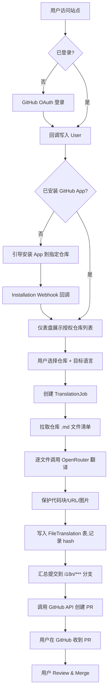
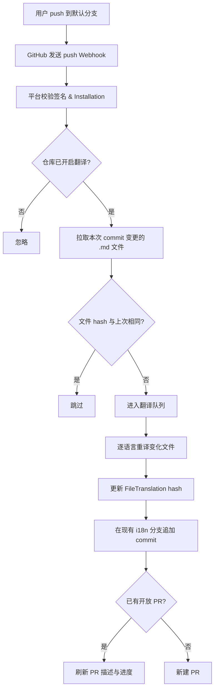
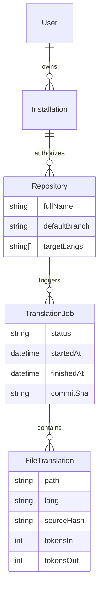

# GitHub Global —— AI 文档翻译平台 PRD

> 让全世界的 GitHub 开源项目，用一次点击拥有多语言文档。

---

## 文档信息

| 项目 | 内容 |
| --- | --- |
| 产品名称 | GitHub Global（暂定） |
| 产品定位 | 面向 GitHub 仓库的 AI 文档翻译 SaaS |
| 文档版本 | v1.1（补充平台风险与画像 C 参与路径） |
| 文档状态 | Draft（评审中） |
| 负责人 | PM / 开发者本人 |
| 最后更新 | 2026-04-20 |

---

## 1. 产品概述

### 1.1 一句话定义
用户登录 GitHub → 选择任意自己有权限的仓库 → 勾选目标语言 → AI 自动翻译其中的 Markdown 文档 → 以 Pull Request 形式提交回仓库；后续 push 时自动增量重译变更文件。

### 1.2 产品价值
- **对开源作者**：免运维地获得高质量多语言文档，提升国际用户覆盖
- **对非英语使用者**：降低阅读门槛，更快上手国外优秀项目
- **对平台自身**：以 GitHub App 为载体，天然沉淀"仓库 × 语言"矩阵，形成增长飞轮

### 1.3 成功指标（北极星 & 辅助指标）

| 类型 | 指标 | MVP 目标（上线 3 个月） |
| --- | --- | --- |
| 北极星 | 每周成功合并的翻译 PR 数 | ≥ 200 |
| 获客 | GitHub App 累计安装数 | ≥ 500 |
| 激活 | 安装后 7 天内完成首次翻译的比例 | ≥ 40% |
| 留存 | 开启增量翻译的仓库比例 | ≥ 25% |
| 质量 | 翻译 PR 被合并（而非关闭）比例 | ≥ 60% |
| 成本 | 单仓库首次翻译平均 AI 成本 | ≤ $0.10（学习期用 `:free` 模型则为 0） |

---

## 2. 目标用户画像与痛点

### 2.1 画像 A：开源作者 / 独立开发者（主要人群）

- **基本特征**：25–40 岁，英文技术写作为母语或工作语言，GitHub 活跃度高，项目 Stars 100–10k
- **典型场景**：
  - 项目突然在海外社区（如掘金、V2EX、Reddit 非英语区）走红，收到"求中文文档"的 Issue
  - 维护者精力有限，手写多语言文档不可持续
- **核心痛点**：
  1. **没时间翻译**：每次 README 改动都要重新同步多语言版本，成本线性增长
  2. **翻译质量参差**：社区 PR 翻译风格不统一，术语前后矛盾
  3. **缺乏自动化**：现有方案要么是手工 + issue 派活，要么是离线脚本，没有一站式产品
- **愿意付费点**：按仓库订阅月费 / 按 token 计费

### 2.2 画像 B：企业 / 团队 DevRel（次要人群）

- **基本特征**：公司有开源项目（SDK、工具库），需要维护英/中/日等多语言开发者文档
- **典型场景**：产品经理更新一版 docs，DevRel 得到通知后再人工翻译并 PR
- **核心痛点**：
  1. 内部文档更新频繁，翻译永远滞后
  2. 多语言一致性难以保证，出现"英文已更新，中文还停留在上个版本"
  3. 合规要求翻译过程可审计（谁翻的、用的什么模型、原文 hash 是多少）

### 2.3 画像 C：非英语技术学习者（受益者，非付费方）

- **基本特征**：英语阅读吃力但想跟进前沿项目的学生 / 初中级开发者
- **在产品中的定位**：
  - **MVP 阶段**：**不允许直接触发翻译**。因为 GitHub App 的授权方向是单向的——只有仓库所有者能授权我们平台写入其仓库，画像 C 对他人仓库没有写入权限，产品上无法通过 PR 回仓
  - **作为需求拉力**：C 通过在目标仓库开 Issue、Star、评论"求中文"，倒逼画像 A/B 安装我们的 App，形成自然增长
  - **P2 阶段的参与路径（二选一或并存）**：
    1. **只读目录站**（见 F-21）：C 贴任意公开仓库 URL，平台拉取翻译，仅在站内展示，不回写 GitHub
    2. **Fork-first 翻译**（见 F-24）：平台帮 C 自动 fork 到其个人账号 → 在 fork 上翻译 → C 手动向上游提 PR，走开源社区标准贡献流程
- **对产品的期望**：能一键看到已翻译的中文文档版本，并能"贡献翻译"获得成就感

---

## 3. 核心用户故事（As a / I want / So that）

### 3.1 P0 用户故事（MVP 必做）

- **US-01 登录**
  As an 开源作者，I want 用 GitHub 账号一键登录，So that 不需要再注册新账号、也不用额外配置 Token。
- **US-02 授权仓库**
  As a 用户，I want 通过安装 GitHub App 授权指定仓库，So that 平台能代我创建分支和 PR，但看不到我不想授权的仓库。
- **US-03 导入并选择仓库**
  As a 用户，I want 在仪表盘看到我授权过的仓库列表并选择其中一个，So that 快速开启翻译。
- **US-04 选择目标语言**
  As a 用户，I want 勾选一个或多个目标语言（中文/日文/西语等），So that 一次任务能批量输出多语言版本。
- **US-05 启动翻译**
  As a 用户，I want 点击"开始翻译"后看到实时进度（总文件数、已完成、失败），So that 对长耗时任务有掌控感。
- **US-06 提交 PR**
  As a 开源作者，I want 翻译完成后产物以 PR 形式提交到我的仓库，So that 我能 review 后再合并，保障主干质量。
- **US-07 保护代码**
  As a 开源作者，I want 翻译器自动跳过代码块、行内代码、URL、图片链接，So that 技术内容不会被 AI 改坏。

> **范围说明**：MVP 仅支持"仓库所有者触发翻译"，不支持"任意登录用户翻译他人仓库"。
> 原因：GitHub App 的 Installation 权限必须由仓库所有者授予；无 Installation 即无法对目标仓库创建分支/PR，这是 GitHub 平台的硬约束，不是产品选择。
> 任意用户参与翻译的场景延后到 P2，通过 **Fork-first 流程（US-16 / F-24）** 或 **只读目录站（US-14 / F-21）** 实现。

### 3.2 P1 用户故事（上线后 1–2 月补齐）

- **US-08 增量翻译**
  As a 开源作者，I want 仓库每次 push 后，只有变化过的 md 文件被重新翻译，So that 节省时间和 token 成本。
- **US-09 术语表**
  As a 团队 DevRel，I want 为仓库配置术语表（如 "Agent" → "智能体"），So that 多次翻译保持术语一致。
- **US-10 模型切换**
  As a 高级用户，I want 选择不同模型（速度优先 / 质量优先 / 免费），So that 在成本和质量之间自由权衡。
- **US-11 翻译历史**
  As a 用户，I want 看到每个文件的翻译历史（时间、模型、耗时、token），So that 做成本分析和质量回溯。

### 3.3 P2 用户故事（长期）

- **US-12 自定义 Prompt**：允许高级用户覆盖系统 Prompt
- **US-13 多人协作**：组织级账户，成员管理，权限分级
- **US-14 翻译目录站**：平台侧公开聚合页，SEO 吸引非付费用户反哺画像 A/B
- **US-15 非 Markdown 文件**：扩展到 MDX、Docusaurus、`.po`、`.json` i18n 文件
- **US-16 Fork-first 翻译（画像 C 参与通道）**
  As a 非英语学习者，I want 对一个原作者未安装本平台的公开仓库，由平台自动帮我 fork 并在 fork 上完成翻译，So that 我能获得中文版文档，并可向上游作者发起 PR 贡献翻译成果。

---

## 4. 功能列表（P0 / P1 / P2 分级）

### 4.1 P0（MVP，首版必交付）

| 编号 | 模块 | 功能 | 验收标准 |
| --- | --- | --- | --- |
| F-01 | 账号 | GitHub OAuth 登录 | 点击登录 → 10 秒内回到仪表盘；数据库有 User 记录 |
| F-02 | 账号 | GitHub App 安装引导 | 未安装时拦截，跳转 App 安装页；安装后回调写入 Installation |
| F-03 | 仓库 | 授权仓库列表 | 展示用户通过 App 授权的所有仓库，分页加载 |
| F-04 | 翻译 | 创建翻译任务（选语言） | 至少支持中/英/日/西/法/德/俄 7 种目标语言 |
| F-05 | 翻译 | Markdown 解析器 | 正确跳过代码块 ``` ```、行内代码 `` ` ``、URL、图片链接 |
| F-06 | 翻译 | OpenRouter 调用（支持 `:free` 模型） | 可通过 `.env` 配置模型 ID，不硬编码 |
| F-07 | 翻译 | 任务进度实时展示 | 前端 SSE 或轮询，秒级刷新状态 |
| F-08 | 产物 | 自动创建翻译分支 | 分支命名规则：`i18n/<lang>-<timestamp>` |
| F-09 | 产物 | 文件命名规则 | 如 `README.md` → `README.zh-CN.md`，同目录放置 |
| F-10 | 产物 | 自动创建 PR | PR 标题/描述自带模型信息、原文 commit hash |
| F-11 | 安全 | 密钥环境变量化 | 无任何硬编码 token / model id |

### 4.2 P1（上线后 4–8 周）

| 编号 | 模块 | 功能 | 优先级理由 |
| --- | --- | --- | --- |
| F-12 | 增量 | Webhook 监听 push 事件 | 决定留存的核心功能 |
| F-13 | 增量 | 原文 hash 比对，跳过未变文件 | 直接决定成本 |
| F-14 | 配置 | 仓库级术语表（yaml） | 企业用户刚需 |
| F-15 | 配置 | 忽略路径（glob） | 避免翻译 `CHANGELOG.md` 等 |
| F-16 | 质量 | 翻译结果 Markdown 结构校验（AST 对齐） | 防止 AI 破坏格式 |
| F-17 | 账单 | Token 用量统计 & 仪表盘 | 付费前置 |

### 4.3 P2（长期规划）

| 编号 | 模块 | 功能 |
| --- | --- | --- |
| F-18 | 多人 | 组织 / 团队权限 |
| F-19 | 定制 | 自定义系统 Prompt |
| F-20 | 扩展 | MDX / Docusaurus / i18n json 支持 |
| F-21 | 聚合 | 公开翻译目录站（SEO 反哺，任意公开仓库只读翻译预览） |
| F-22 | 付费 | Stripe 订阅 + 用量计费 |
| F-23 | 质量 | 人工审核 / 社区 review 环节 |
| F-24 | 参与 | Fork-first 翻译（画像 C 通道，自动 fork + 译 + 引导向上游发 PR） |
| F-25 | 生态 | 多平台适配器（GitLab / Gitee / Bitbucket），降低对 GitHub 单点依赖 |
| F-26 | 数据 | 翻译记忆库 TM（沉淀术语、原文-译文对、用户手工修正） |

---

## 5. 关键业务流程图

### 5.1 首次翻译完整链路



### 5.2 增量翻译触发链路



### 5.3 数据对象关系（ER 简图）



---

## 6. 非功能需求

### 6.1 安全

| 项 | 要求 |
| --- | --- |
| 认证 | 仅接受 GitHub OAuth + GitHub App 双通道，拒绝密码登录 |
| 授权 | 仓库粒度权限严格来自 GitHub Installation，平台不做越权推断 |
| Webhook | 必须校验 `X-Hub-Signature-256`，拒绝无签名请求 |
| 密钥 | 所有 Token、Client Secret、App 私钥仅存于环境变量或 Vercel Secrets；代码仓库扫描零命中 |
| 数据最小化 | 不持久化仓库源码，翻译结束后仅保留元数据 + hash，不留原文/译文全文（MVP 可先保留便于调试，GA 前下线） |
| 审计 | 每个翻译操作记录：谁触发、哪个模型、输入输出 token、原文 hash |
| 分支保护 | 平台永远**不直接 push 到默认分支**，只通过 PR |

### 6.2 性能

| 指标 | 目标 |
| --- | --- |
| 首屏加载 | P75 ≤ 2s（Vercel Edge + App Router 静态部分） |
| 启动翻译后首个文件出结果 | ≤ 10s |
| 单文件（~500 行 md）翻译 | ≤ 30s（取决于模型） |
| 并发仓库翻译 | MVP 支持同时 10 个任务，用队列解耦 |
| Webhook 响应 | ≤ 3s 返回 200，重活丢入队列异步处理（GitHub 超时 10s） |

### 6.3 成本

| 项 | 策略 |
| --- | --- |
| AI 成本 | 学习期全部使用 OpenRouter `:free` 后缀模型，成本为 0；GA 时对外用户走付费模型并按 token 计费 |
| 数据库 | Neon Free Tier 启动，超过再升 |
| 部署 | Vercel Hobby 起步，商用流量再升 Pro |
| 队列 | MVP 用数据库表模拟队列，避免引入 Redis 增加费用；P1 视量级再上 Upstash |
| 成本防护 | 单仓库单日翻译字符数上限（默认 50 万字符）；超限需用户确认 |

### 6.4 可维护性 / 可观测性

- 所有关键动作（翻译、PR、Webhook）写入数据库 + Vercel 日志
- 翻译失败必须能一键"在相同配置下重试"
- 模型 ID、系统 Prompt 走配置，不发版也能调整

### 6.5 合规

- 遵守 GitHub App 市场上架准则（隐私政策、数据使用声明）
- 不翻译私有仓库内被标记 `.gitattributes: export-ignore` 的文件（P1）
- 对欧盟用户提供数据删除入口（GDPR）

---

## 7. 竞品分析

### 7.1 竞品一：[GitLocalize](https://gitlocalize.com/)

- **形态**：GitHub App + SaaS 平台，社区译者协作翻译 md / po 文件
- **优势**：
  - 起步早、已有一定规模社区译者池
  - 支持多种文件格式（md、po、yml）
- **劣势**：
  - **人工驱动**，译者响应慢，小项目根本招不到译者
  - UI 偏老旧，产品迭代缓慢
- **差异点（我们赢在哪）**：
  - 我们是 **AI 驱动，零等待**，不需要招募译者
  - 我们做 **增量翻译**，GitLocalize 靠人工，不存在真正意义的自动增量

### 7.2 竞品二：[Crowdin](https://crowdin.com/) / [Lokalise](https://lokalise.com/)

- **形态**：企业级本地化 SaaS，对接 GitHub、GitLab 等
- **优势**：
  - 功能极其齐全（TM、术语表、工作流、review）
  - 企业客户背书，付费模式成熟
- **劣势**：
  - **重、贵、学习成本高**，个人开源作者用不起也用不惯
  - 主要为**产品级 i18n（strings）**设计，开源作者主要需求（README / docs）不是其主打
- **差异点**：
  - 我们 **极简聚焦"GitHub 仓库的 md 文档翻译"**，一键安装、一键开跑
  - 我们面向**开源作者免费起步**，而非面向企业预算

### 7.3 竞品三：自建脚本 / GitHub Action（如 `translate-readme-action`、各类 DIY 工作流）

- **形态**：社区开发者写的 Action，调用 Google Translate / DeepL / OpenAI，在 push 时翻译 README
- **优势**：
  - 免费、可定制
  - 轻量，嵌入现有 CI
- **劣势**：
  - **需要用户懂 Action 配置**，新手劝退
  - 各自为战，没有统一的 **术语表、历史、质量校验**
  - 大多只翻 `README.md`，不处理多文档/多语言矩阵
  - 没有**管理面板**，出了问题只能翻 Action 日志
- **差异点**：
  - 我们是**产品 vs 零件**，对非技术型维护者和技术型维护者都降低了心智成本
  - 我们提供**仪表盘、历史、成本看板、术语表**一整套，这些写 Action 要自己再造一遍

### 7.4 竞品四（潜在）：GitHub 官方未来可能自建翻译功能

- **形态推测**：若推出，最可能以 Copilot 子能力形式出现（如 "Copilot Docs Translate"），或在 Pull Request 编辑器里嵌一个"翻译此文件"按钮
- **发生概率判断**：**中低**。理由：
  1. GitHub 历史上对"小众 + 长尾"功能（翻译、i18n、Changelog 自动化）倾向留给生态；GitLocalize、Crowdin 存在 10+ 年未被吞并
  2. GitHub 近年 AI 投入集中在 Copilot 本体（代码补全 / Chat / Agent），文档翻译 ROI 偏低
  3. GitHub 做官方功能必须"全球一碗水"，难以为特定语种（如中文圈）做精细运营
- **若真发生，我们的护城河**：
  1. **工作流深度**：增量翻译、AST 结构校验、术语记忆、多语言一致性——GitHub 只会做 MVP 版
  2. **数据资产**：翻译记忆库 TM（F-26）沉淀的术语-风格-修正数据，是随时间单调增长的壁垒
  3. **多平台覆盖**：扩展到 GitLab / Gitee / Bitbucket（F-25），摆脱对 GitHub 单点依赖
  4. **垂直运营**：针对中文 / 日文 / 西语开发者社区做深耕，GitHub 做不到这种本地化运营
  5. **定价灵活**：按仓库 / 按组织 / 按 token 多维组合，GitHub 官方功能通常只能捆绑在 Copilot SKU 里

### 7.5 差异化一句话总结

> **GitLocalize 靠人工，Crowdin 卖给企业，Action 需要你自己攒，GitHub 官方大概率不会亲自下场——而我们用 AI 把"给 GitHub 开源项目做多语言文档"变成点两下鼠标就能搞定的事，并通过翻译记忆库和多平台适配把赛道越做越深。**

---

## 8. 里程碑规划

| 阶段 | 周期 | 交付目标 |
| --- | --- | --- |
| M0 脚手架 | 第 1 周 | Next.js 15 + Prisma + Neon + shadcn 初始化，GitHub OAuth 跑通 |
| M1 核心链路 | 第 2–3 周 | GitHub App 安装 + 仓库列表 + 单文件翻译 demo（本地 cloudflared 调试 Webhook） |
| M2 MVP | 第 4–6 周 | P0 全部功能完成，可端到端跑出 PR |
| M3 上线 Beta | 第 7 周 | Vercel 部署，邀请 20 位种子作者试用 |
| M4 增量翻译 | 第 8–10 周 | P1 的 F-12/F-13/F-16 上线 |
| M5 付费化 | 第 11–14 周 | Token 计费 + Stripe，GA |

---

## 9. 风险与假设

| 类型 | 项 | 缓解方案 |
| --- | --- | --- |
| 技术 | AI 破坏 Markdown 结构 | AST 对齐校验（F-16），校验不过自动回滚本文件 |
| 技术 | 长文档超出模型上下文 | 分段翻译 + 段间上下文窗口 |
| 成本 | 用户恶意翻译超大仓库 | 单仓库单日字符数上限 + 人工审批 |
| 产品 | 开源作者不愿意合并 AI 生成的 PR | PR 描述透明化（模型、原文 hash、diff 预览），支持一键 close |
| 合规 | GitHub App 审核驳回 | 严格遵守权限最小化原则，私有仓库不存原文 |
| 市场 | GitHub 自己出类似功能 | 专注"质量 + 工作流"差异，并尽快沉淀术语表/历史这类长期资产 |
| 战略 | **平台风险（Platform Risk）**：寄生 GitHub 生态，GitHub 政策变更 / 自建功能 / 限流都会直接伤害产品 | ① 抽象"仓库-分支-PR"为平台自有概念，GitHub 仅作适配器（为 F-25 多平台打底）② 尽早沉淀翻译记忆库 TM（F-26），即使换平台数据资产仍在 ③ 绑定中文开发者社区关系（掘金、V2EX、B 站），建立"人"的护城河 ④ 保留"被收购 / 转型独立 TM SaaS"的战略回退路线 |
| 合规 | 文档版权归属：AI 翻译产物的著作权归谁？可否闭源商用？ | PR 描述中明确标注"AI-generated, 请原作者审核后合并"，由原作者合并行为视为接受；用户协议明确平台不主张译文所有权 |
| 文档版本 | 文档更新说明 | v1.1：补充画像 C 参与路径、Fork-first 与目录站分工、GitHub 平台风险与护城河、翻译记忆库 TM 作为长期资产 |

---

## 10. 开放问题（Open Questions）

1. 学习期是否允许私有仓库接入？（目前倾向**仅公开仓库**，降低数据合规压力）
2. 术语表放仓库里（`.github/i18n.yaml`）还是放平台侧？（倾向**仓库里**，天然版本化）
3. 翻译 PR 是否允许多次合并到同一分支，还是每次新开 PR？（倾向**同分支追加**，减少 PR 噪音）
4. 免费额度如何设定才能既吸引开源作者、又避免滥用？

---

> 本 PRD 为 v1.0 Draft，任何修改请通过 PR 提交到 `docs/PRD.md` 并在 Commit Message 中注明变更原因。
